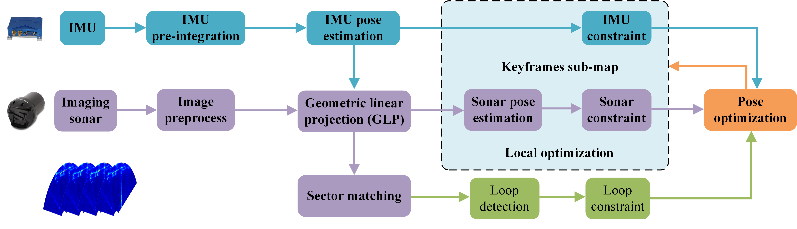

# Fast-ISIO: Fast Imaging Sonar-Inertial Odometry for Underwater Robots via Geometric Linear Mapping

Fast-isio is a fast and robust sonar inertial odometer system for underwater robots. Through the tight coupling fusion of IMU pre integration and imaging sonar, combined with GLP (geometric linear mapping) and sector matching strategy, it realizes high-precision and high robustness underwater pose estimation.

---

## 📡 Framework Architecture


---

## 📦 Installation dependencies
- Ubuntu 20.04
- ROS Noetic
- C++17
- Eigen3
- PCL
- OpenCV
- GTSAM
- OpenMP
- octomap
- Armadillo
- Boost
- BLAS
- LAPACK
- If python related libraries are missing, please 'pip install' for installation

### Clone repository and compile
```bash\mkdir -p ~/fast_isio_ws/src
cd ~/fast_isio_ws/src
git clone https://github.com/StarTeardrop/Fast-ISIO.git
cd ..
catkin_make
source devel/setup.bash
```
---

## 🚀 Tutorials
### 1. Running
```bash
roslaunch isio fast_isio_run.launch
```

### 2. play rosbag
```bash
rosbag play ....bag
TODO: Rosbag will be uploaded later
```

### 3. Parameter file path：
```
isio/config/param.yaml
```
---

## 🎥 Video Demo

### 1. Simulation Scene1


### 2. Simulation Scene2


## 📝 TODO
- [ ] Add use documents
- [ ] Upload different rosbags
- [ ] Update the latest version
- [ ] Please pay attention to the Aqua-Verse underwater simulator: https://github.com/StarTeardrop/AquaVerse.git

